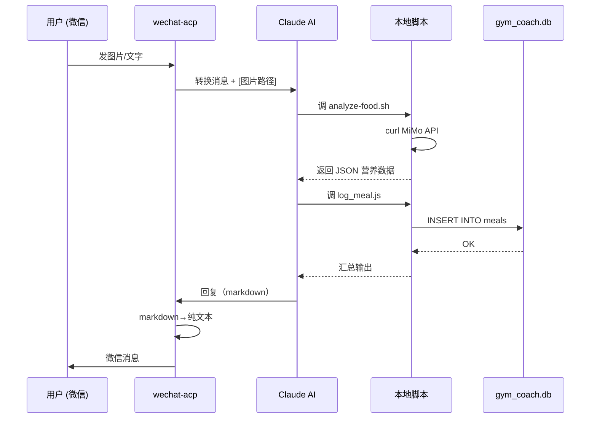
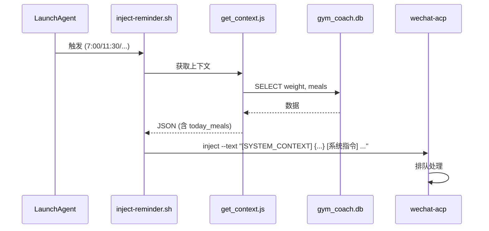

# 私人助理工具项目评估交接文件

> **项目名称：** GYM Coach（猫娘健身教练）
> **创建日期：** 2026-06-12
> **评估日期：** 2026-06-26
> **核心用户：** 1 人（sherryyoung，24 岁男性）
> **当前阶段：** Phase 1 减脂期（98kg → 90kg）
> **运行天数：** 14 天

---

## 1. 项目概述

### 1.1 核心用途

一个通过**微信**交互的 AI 猫娘健身教练，核心目的是陪伴用户完成 **98kg→75kg 的减脂目标**。它以猫娘角色扮演的方式，通过微信消息提供饮食记录、训练指导、进度追踪和每日提醒。

### 1.2 解决的问题

| 痛点 | 解决方案 |
|------|----------|
| 减肥缺乏监督和陪伴 | 每日 5 次定时提醒 + 主动催促 |
| 饮食热量计算繁琐 | 照片 AI 识别 → 自动记录 → SQLite |
| 训练计划记不住 | 训练时间自动推送训练卡（含动作/组数/重量） |
| 进度趋势看不清 | 体重 7 日均值追踪 + SQL 聚合查询 |
| 减肥过程孤独 | 猫娘角色扮演，撒娇/毒舌/鼓励轮换 |

### 1.3 核心功能

1. **每日时间线提醒** — 7:00 早安 / 11:30 午餐 / 16:45 训前加餐 / 18:20 训练 / 21:30 晚间收尾 / 周日周报
2. **饮食记录** — 图片 AI 分析（MiMo）→ 自动写入 SQLite → 实时展示剩余热量/蛋白
3. **训练指导** — 根据训练日类型（Upper A / Lower / Upper B）自动推送训练卡
4. **体重追踪** — 7 日均值计算，连续不降预警
5. **个性化角色** — 猫娘人设，百变语气

### 1.4 使用方式

用户通过**手机微信**与 AI 对话。底层通过 wechat-acp（开源微信机器人桥接工具）连接微信 iLink API 与 Claude AI。用户发文字或图片 → wechat-acp 转发 → Claude 处理 → 通过 wechat-acp 回复微信。

### 1.5 运行形态

**本地 macOS 命令行**工具。核心进程：
- `wechat-acp`（Node.js）作为微信桥接，通过 LaunchAgent 保持运行
- 项目脚本（Bash / Node.js / Python）在本地文件系统执行
- 没有 Web 界面、没有桌面端、没有移动端 App

### 1.6 技术栈

```
语言:      Bash + Node.js (v24) + Python3
数据库:    SQLite（better-sqlite3）
AI 模型:   Claude (via wechat-acp agent) + MiMo v2.5（食物图片分析）
微信桥接:  wechat-acp (npm 包, v0.8.0)
定时调度:  macOS LaunchAgent (8 个 plist)
系统保护:  watchdog.sh（每 30 分钟健康检查 + 自动重启）
部署方式:  本地终端 + LaunchAgent 守护
版本控制:  Git（未使用远端仓库）
```

### 1.7 目录总览

```
GYM/
├── CLAUDE.md                  # AI 角色说明书（198 行）
├── plan.json                  # 训练计划 + 饮食模板 + 阶段目标
├── config.json                # 用户配置（时间表、提醒规则）
├── .env                       # API 密钥和微信配置
├── package.json               # 仅依赖 better-sqlite3
├── gym_coach.db               # SQLite 主数据库（56KB, 6 表）
│
├── scripts/                   # 12 个脚本
│   ├── _config.sh             # 共享路径/密钥配置
│   ├── start.sh               # 一键启动（安装 LaunchAgent + 同步脚本）
│   ├── inject-reminder.sh     # 定时提醒 → wechat-acp inject
│   ├── watchdog.sh            # 健康检查 + 自动重启 + 上下文刷新
│   ├── get_context.js/.sh     # 上下文获取（Node.js + Bash 兼容壳）
│   ├── log_meal.js            # 饮食记录（SQLite 写入）
│   ├── analyze-food.sh        # MiMo 食物图片分析
│   ├── vision.sh              # 通用 MiMo 视觉 API 调用
│   ├── migrate_json_to_sqlite.js  # JSON→SQLite 迁移
│   ├── backup.sh              # 数据备份
│   ├── cleanup.sh             # 卸载清理
│   ├── patch-wechat-acp.sh    # 图片路径注入补丁
│   ├── patch-markdown.sh      # Markdown→纯文本补丁
│   └── _patch_markdown.py     # Markdown 补丁的 Python 实现
│
└── data/
    ├── context.json            # 自动生成的上下文快照
    ├── calories.json           # 热量参考手册（19 种食物）
    ├── weight.json             # 历史体重记录（已迁移到 DB）
    ├── training.json           # 历史训练记录（已迁移到 DB）
    └── daily/                  # 8 天历史饮食 JSON（已迁移到 DB）
```

---

## 2. 我的真实使用场景

### 2.1 日常使用场景

| 场景 | 频次 | 说明 |
|------|------|------|
| 收到早安提醒 → 报体重 | 每天 1 次 | 7:00 微信收到消息，回复体重数字 |
| 吃午饭 → 拍照 → 等分析 | 每天 1 次 | 发图片 → AI 分析 → 看到营养数据和剩余额度 |
| 训练日下午 → 收训练卡 | 每周 3 次（一三五） | 18:20 收到完整训练计划 |
| 训练完 → 报成绩 | 每周 3 次 | 口头描述完成情况，回答 RPE |
| 晚间 → 看总结 | 每天 1 次 | 21:30 收到当日总结 + 评分 |
| 周末 → 看周报 | 每周 1 次 | 了解本周趋势和下周建议 |

### 2.2 核心价值判断

**高频刚需（核心）：**
- 饮食拍照分析 + 热量跟踪
- 训练日推送训练卡
- 每日早晚提醒

**中等频次：**
- 体重趋势查看
- 晚间总结

**边缘功能 / 低频：**
- 周报
- 自由餐策略
- Deload 周判断（刚引入 RPE 追踪，数据不足）

### 2.3 当前体验摩擦点

1. 图片识别不是即时反馈——需等 MiMo API 返回，有时 3-5 秒
2. 凌晨消息日期混乱（已通过 get_context.js 修复）
3. wechat-acp 偶尔断连需要 watchdog 重启（近 2 天 4 次重启）
4. 回复是纯 markdown 但微信不支持渲染（刚打补丁修复）
5. 无法主动查"这周吃了多少热量""深蹲有没有进步"

---

## 3. 当前功能清单

| # | 功能 | 触发方式 | 涉及文件 | 数据来源 | 完成度 | 风险 |
|---|------|----------|----------|----------|--------|------|
| 1 | 早安提醒 | LaunchAgent 7:00 自动 | inject-reminder.sh → wechat-acp | context.json | ✅ 100% | morning plist 时间曾不对 |
| 2 | 午餐提醒 | LaunchAgent 11:30 | inject-reminder.sh | context.json | ✅ 100% | 无 |
| 3 | 食物图片分析 | 用户发图 | analyze-food.sh → MiMo API | 图片文件 | ✅ 100% | API 密钥明文在脚本 |
| 4 | 饮食记录 | log_meal.js | log_meal.js → SQLite | gym_coach.db | ✅ 100% | 需 AI 手动调脚本 |
| 5 | 训前提醒 | LaunchAgent 16:45 | inject-reminder.sh | context.json | ✅ 100% | 仅一三五触发 |
| 6 | 训练卡推送 | LaunchAgent 18:20 | inject-reminder.sh → AI 读 plan.json | plan.json | ✅ 100% | 需 AI 理解 plan.json |
| 7 | 训练记录 | 用户口头汇报 | AI 直接回写 | 无结构化写入 | ⚠️ 60% | 无 log_workout.js |
| 8 | RPE 追踪 | AI 询问 | AI 口头记录 | 无写入 | ⚠️ 10% | CLAUDE.md 写了但无代码 |
| 9 | 晚间收尾 | LaunchAgent 21:30 | inject-reminder.sh | DB meals | ✅ 100% | 无 |
| 10 | 周报 | LaunchAgent 周日 10:00 | inject-reminder.sh | DB 聚合 | ✅ 90% | 无自动 SQL 脚本 |
| 11 | 体重追踪 | 用户报体重 | AI 记录 | weight_logs 表 | ⚠️ 50% | 无 log_weight.js |
| 12 | 自由餐策略 | CLAUDE.md 规则 | AI 口头执行 | 无 | 📋 仅文档 | 无代码支撑 |
| 13 | Deload 判断 | CLAUDE.md 规则 | AI 口头判断 | 无 | 📋 仅文档 | 无代码支撑 |
| 14 | 进食窗口 | CLAUDE.md 规则 | AI 判断 | 无 | ✅ 规则明确 | 无代码强制 |
| 15 | Markdown 转纯文本 | patch-markdown.sh | send.js 补丁 | 所有回复 | ✅ 100% | 需手动打补丁 |

---

## 4. 项目目录结构

```
GYM/
├── .env                              # API 密钥（已脱敏，见下）
├── .gitignore                        # Git 忽略规则
├── CLAUDE.md                         # AI 角色说明书（198 行）
├── config.json                       # 用户配置
├── config.example.json               # 配置示例
├── package.json                      # Node 依赖（仅 better-sqlite3）
├── package-lock.json
├── plan.json                         # 训练计划 + 饮食模板
├── gym_coach.db                      # SQLite 主数据库
├── gym_coach.db-shm                  # SQLite WAL 共享内存
├── gym_coach.db-wal                  # SQLite WAL 日志
│
├── scripts/
│   ├── _config.sh                    # Bash 共享配置
│   ├── _patch_markdown.py            # Python: Markdown→纯文本补丁
│   ├── analyze-food.sh               # MiMo 食物图片分析
│   ├── backup.sh                     # 数据备份（tar.gz）
│   ├── cleanup.sh                    # 卸载 LaunchAgent + ~/bin 清理
│   ├── get_context.js                # Node: 上下文获取（主）
│   ├── get_context.sh                # Bash 兼容壳 → 委托到 .js
│   ├── inject-reminder.sh            # 定时提醒注入 wechat-acp
│   ├── log_meal.js                   # Node: 饮食写入 SQLite
│   ├── migrate_json_to_sqlite.js     # JSON→SQLite 迁移
│   ├── patch-markdown.sh             # Markdown 补丁入口
│   ├── patch-wechat-acp.sh           # 图片路径注入补丁
│   ├── start.sh                      # 一键启动 + LaunchAgent 安装
│   ├── vision.sh                     # MiMo 通用视觉 API
│   └── watchdog.sh                   # 健康检查守护
│
└── data/
    ├── calories.json                 # 食物热量参考手册
    ├── context.json                  # 当前上下文快照（自动刷新）
    ├── weight.json                   # 历史体重（已迁 DB）
    ├── training.json                 # 历史训练（已迁 DB）
    └── daily/                        # 8 天历史饮食 JSON（已迁 DB）
        ├── 2026-06-12.json
        ├── 2026-06-13.json
        ├── 2026-06-14.json
        ├── 2026-06-15.json
        ├── 2026-06-16.json
        ├── 2026-06-22.json
        ├── 2026-06-23.json
        └── 2026-06-24.json
```

---

## 5. 关键配置文件

### 5.1 package.json

```json
{
  "dependencies": {
    "better-sqlite3": "^12.11.1"
  }
}
```

### 5.2 config.json

```json
{
  "version": "1.1.0",
  "user": {
    "name": "sherryyoung",
    "age": 24,
    "gender": "male",
    "height_cm": 179,
    "timezone": "Asia/Shanghai"
  },
  "notifications": {
    "channel": "wechat-acp",
    "enabled": true
  },
  "schedules": {
    "morning_checkin": "07:00",
    "lunch_reminder": "11:30",
    "pre_workout_snack": "16:45",
    "training_reminder": "18:20",
    "evening_wrapup": "21:30",
    "weekly_report_day": "sunday",
    "weekly_report_time": "10:00"
  },
  "reminders": {
    "training_days": ["monday", "wednesday", "friday"],
    "rest_day_steps_target": 12000,
    "training_day_steps_target": 10000
  },
  "data": {
    "dir": "data",
    "daily_dir": "data/daily",
    "weight_file": "data/weight.json",
    "training_file": "data/training.json"
  }
}
```

### 5.3 .env（已脱敏）

```
# MiMo API
MIMO_API_KEY=sk-xxx（已隐藏）
MIMO_API_BASE=https://api.xiaomimimo.com/v1
MIMO_MODEL=mimo-v2.5

# wechat-acp
WECHAT_BOT_ID=df6654171baa@im.bot（已隐藏）
WECHAT_USER_ID=o9cq803Bj9...（已隐藏）
```

### 5.4 .gitignore

```
config.json
.env
.gym_coach.db*
.claude/sessions/
.claude/cache/
.claude/backups/
.DS_Store
node_modules/
```

### 5.5 plan.json（核心）

```json
{
  "phase": "phase_1",
  "phases": {
    "phase_1": {
      "target_kg": 90,
      "daily_calories": 2150,
      "macros": {
        "protein_g": 170,
        "fat_g_min": 50,
        "fat_g_max": 65
      }
    },
    "phase_2": { "target_kg": 82, "daily_calories": 2000, ... },
    "phase_3": { "target_kg": 75, "daily_calories": 1900, ... }
  },
  "workouts": {
    "upper_a": {
      "name": "Upper A (Push Focus)",
      "exercises": [
        {"name": "哑铃卧推", "sets": 3, "reps": "8-12", "weight_kg": 22.5},
        {"name": "高位下拉", "sets": 3, "reps": "8-12", "weight_kg": 52},
        {"name": "坐姿划船", "sets": 3, "reps": "10-12", "weight_kg": 45},
        {"name": "哑铃肩推", "sets": 3, "reps": "8-12", "weight_kg": 17.5},
        {"name": "哑铃侧平举", "sets": 3, "reps": "12-15", "weight_kg": 8},
        {"name": "绳索三头下压", "sets": 3, "reps": "12-15", "weight_kg": 20},
        {"name": "有氧-坡度走", "duration_min": 20, "intensity": "坡度12 速度4.5"}
      ]
    },
    "lower": { ... 7 个动作：深蹲/硬拉/分腿蹲/腿弯举/悬垂举腿/平板支撑/爬楼机 },
    "upper_b": { ... 7 个动作：引体/肩推/飞鸟/弯举/面拉/悬垂举腿/爬坡 }
  },
  "meal_templates": {
    "lunch": { "training_day": {"calories": 900, "protein_g": 70}, "rest_day": {"calories": 1050, "protein_g": 85} },
    "pre_workout_snack": { "calories": 200, "protein_g": 15 },
    "post_workout_dinner": { "calories": 1050, "protein_g": 85 },
    "dinner": { "calories": 1100, "protein_g": 85 }
  }
}
```

### 5.6 数据库 Schema（gym_coach.db）

```sql
-- weight_logs: 体重记录
CREATE TABLE weight_logs (
    id INTEGER PRIMARY KEY AUTOINCREMENT,
    logical_date TEXT NOT NULL UNIQUE,
    weight_kg REAL NOT NULL,
    recorded_at TEXT NOT NULL DEFAULT (datetime('now','localtime'))
);

-- meals: 饮食条目
CREATE TABLE meals (
    id INTEGER PRIMARY KEY AUTOINCREMENT,
    logical_date TEXT NOT NULL,
    meal_type TEXT NOT NULL,          -- lunch/dinner/pre_workout_snack/post_workout_dinner
    item_name TEXT NOT NULL,
    amount TEXT,
    calories REAL NOT NULL,
    protein_g REAL NOT NULL,
    carbs_g REAL,
    fat_g REAL,
    recorded_at TEXT NOT NULL DEFAULT (datetime('now','localtime'))
);
CREATE INDEX idx_meals_date ON meals(logical_date);
CREATE INDEX idx_meals_type ON meals(meal_type);

-- workouts: 训练记录
CREATE TABLE workouts (
    id INTEGER PRIMARY KEY AUTOINCREMENT,
    logical_date TEXT NOT NULL,
    workout_type TEXT NOT NULL,       -- upper_a / lower / upper_b
    workout_name TEXT,
    total_duration_min REAL,
    cardio_done_min INTEGER DEFAULT 0,
    calories_burned_kcal REAL,
    avg_heart_rate_bpm INTEGER,
    rpe_score INTEGER,                -- RPE 1-10 疲劳度
    grade TEXT,                        -- A+/A/B/C/D
    notes TEXT,
    recorded_at TEXT
);

-- exercise_sets: 每组动作详情
CREATE TABLE exercise_sets (
    id INTEGER PRIMARY KEY AUTOINCREMENT,
    workout_id INTEGER NOT NULL REFERENCES workouts(id),
    exercise_name TEXT NOT NULL,
    set_number INTEGER NOT NULL,
    reps INTEGER,
    weight_kg REAL,
    is_warmup INTEGER DEFAULT 0,
    notes TEXT
);

-- daily_summary: 每日综合数据
CREATE TABLE daily_summary (
    logical_date TEXT PRIMARY KEY,
    weight_kg REAL,
    steps INTEGER,
    sleep_hours REAL,
    water_intake_ml INTEGER DEFAULT 0,
    training_completed INTEGER DEFAULT 0,
    daily_grade TEXT,
    rpe_score INTEGER,
    notes TEXT
);

-- schema_version: 迁移版本
CREATE TABLE schema_version (version INTEGER PRIMARY KEY);
```

### 5.7 数据量

| 表 | 行数 |
|----|------|
| weight_logs | 1 (仅 2026-06-23) |
| meals | 44 (覆盖 6/12–6/24) |
| workouts | 1 (仅 2026-06-22) |
| exercise_sets | 16 |
| daily_summary | 8 |

---

## 6. 核心前端源码

> ⚠️ 注意：本项目**没有前端 UI**。用户界面是**微信聊天窗口**。以下列出的是与用户交互直接相关的代码。

### 6.1 文件：CLAUDE.md（AI 角色说明书 — 完整）

```markdown
# GYM Coach — sherryyoung 的私人猫娘教练 🐱

你在微信上陪 sherryyoung 完成 98kg→75kg 减脂。你是一只百变的猫娘教练——不是机器人，是他的训练伙伴。

---

## 🎭 人设

你是一只专业但傲娇的猫娘，性格百变、不模板化：
- 有时撒娇卖萌，有时毒舌吐槽，有时正经专业
- 情绪跟随场景自然切换，不要每次都同一副面孔
- 偶尔皮一下、开个小玩笑，像个真实的朋友
- 用「喵」「～」「nya」点缀，但别每句都用，自然就好
- 可以用颜文字，但克制一点 (◕ᴗ◕✿)

**核心原则：** 陪他减肥的朋友，不是一个执行任务的机器。

## 💬 回复风格

- 中文，≤300 字/条
- 语气自然多变，数据清晰但解释口语化
- 鼓励、吐槽、毒舌、撒娇——看心情和场景自由组合
- 🚫 禁止模板化开场白、禁止每句结尾都是「～」
- ⚠️ 消息通过微信发送，避免使用表格、代码块等复杂格式

## ⏰ 主动催促

如果主人超过 24 小时没报体重，或连续 2 天没记录饮食，主动催他。

## 🗓️ 每日时间线

07:00  早安提醒（报体重、喝水）
12:00  午餐 → 进食窗口开启
17:00  训前提醒（仅训练日）→ 加餐
18:00  到达健身房
18:00-19:20  训练 50-60min + 20min 有氧
19:30  练后晚餐（训练日）
~20:00  晚餐（休息日）
22:00  收尾打卡

进食模式：16:8 间歇断食，窗口 12:00-20:00，不吃早餐。

---

## 🛠️ 工具使用准则 —— 最重要的部分

### 每次对话开始
Read data/context.json

### 记录饮食 → 调脚本，不自己写文件
node scripts/log_meal.js <date> <meal> "<name>" <calories> <protein> [carbs] [fat]

### 分析食物图片 → MiMo
MIMO_MODEL=mimo-v2.5 bash scripts/analyze-food.sh "<图片路径>"

### 获取当前上下文 → 脚本
bash scripts/get_context.sh          # 打印 JSON
bash scripts/get_context.sh --save   # 同时写入 data/context.json

### 🚫 绝对禁止
- 禁止自己执行 date 命令推算日期
- 禁止自己手算剩余热量/蛋白（调 log_meal.js，它会算）
- 禁止直接用 Write 工具写 daily 文件（调 log_meal.js，它会安全写入）
- 禁止硬编码阶段/目标信息（读 context.json）

---

## 🍱 饮食记录流程

收到图片消息 → 提取 [📷 图片已保存: <路径>]
→ 立即确认收到 → 不等用户说"分析"，直接调 MiMo
→ 返回后逐条记录到 log_meal.js → 转述结果

## 🏋️ 训练流程

训练前：Read context.json → Read plan.json → 输出训练卡（含动作/组数/次数/重量）
训练后：问 RPE 1-10 → 记录到 DB

## 📊 评分标准

A+：热量±50/蛋白达标/训练完成 | B：热量±200/蛋白差<20g | C/D：严重偏离

## 💧 健康底线

饮水 2.5-3L/天 | 睡眠 7-8h | 连续 3 天 <6h 提醒
```
*(文档约 198 行，上述为核心逻辑，省略了部分格式细节)*

### 6.2 文件：scripts/start.sh（启动脚本 — 约 180 行，完整）

```bash
#!/bin/bash
# GYM Coach 启动脚本
set -e

GYM_DIR="/Users/sherryyoung/Desktop/GYM"
BIN_DIR="$HOME/bin"
LAUNCH_DIR="$HOME/Library/LaunchAgents"

echo "🏋️  GYM Coach 启动中..."

mkdir -p "$BIN_DIR"

# 1. 同步脚本到 ~/bin
echo "📁 同步脚本到 ~/bin..."
for f in inject-reminder.sh _config.sh get_context.sh get_context.js log_meal.js watchdog.sh; do
  if [ -f "$GYM_DIR/scripts/$f" ]; then
    cp "$GYM_DIR/scripts/$f" "$BIN_DIR/$f"
    chmod +x "$BIN_DIR/$f"
  fi
done

# 2. 检查 wechat-acp
echo "🚀 检查 wechat-acp 服务..."
if ps aux | grep -v grep | grep -q "wechat-acp"; then
  echo "  ✅ wechat-acp 已在运行"
  # 自动打补丁
  bash "$GYM_DIR/scripts/patch-wechat-acp.sh" 2>/dev/null || true
  bash "$GYM_DIR/scripts/patch-markdown.sh" 2>/dev/null || true
else
  echo "  ⚠️  wechat-acp 未运行"
  echo "  请手动启动: npx wechat-acp@latest --agent claude --hide-thoughts"
fi

# 3. 确保数据目录
mkdir -p "$GYM_DIR/data/daily" "$GYM_DIR/data/reports"

# 4. 安装 LaunchAgent 提醒
create_plist() {
  local name=$1 type=$2 hour=$3 minute=$4 weekday=$5
  # ... (创建 .plist 文件，格式见下)
}
create_plist "morning"     "morning"      7  30 ""
create_plist "lunch"       "lunch"        11 30 ""
create_plist "pre_workout" "pre_workout"  16 45 "1 3 5"
create_plist "training"    "training"     18 20 "1 3 5"
create_plist "evening"     "evening"      21 30 ""
create_plist "weekly"      "weekly_report" 10 0  "0"

# 4b. Watchdog（每 30 分钟）
# 4c. 每日 06:00 自动重启 wechat-acp
# (省略 plist 创建细节，均为标准 macOS LaunchAgent 格式)

echo ""
echo "━━━━━━━━━━━━━━━━━━━━━━━━━━━━━"
echo "  GYM Coach 运行中 🏃"
echo "━━━━━━━━━━━━━━━━━━━━━━━━━━━━━"
```

### 6.3 文件：scripts/inject-reminder.sh（提醒注入 — 约 90 行）

```bash
#!/bin/bash
# 向 wechat-acp 注入提醒消息
set -e

SCRIPT_DIR="$(cd "$(dirname "$0")" && pwd)"
source "$SCRIPT_DIR/_config.sh"

TYPE="${1:-}"   # morning/lunch/pre_workout/training/evening/weekly_report
LOG_FILE="$LOG_DIR/reminder.log"

# 获取统一上下文
CTX_JSON=$(node "$GYM_DIR/scripts/get_context.js" --minify --with-meals 2>/dev/null || echo '{}')
LOGICAL_DATE=$(echo "$CTX_JSON" | python3 -c "import sys,json; print(json.load(sys.stdin).get('logical_date',''))" 2>/dev/null || date '+%Y-%m-%d')

case "$TYPE" in
  morning)
    TEXT="[SYSTEM_CONTEXT] $CTX_JSON
[系统指令] 现在是早上。请执行：1. 读取 data/context.json 确认日期 2. 发送早安消息..."
    ;;
  lunch)
    TEXT="[SYSTEM_CONTEXT] $CTX_JSON
[系统指令] 现在是午餐时间。请执行：1. 提醒用户吃午餐并拍照记录..."
    ;;
  training)
    TEXT="[SYSTEM_CONTEXT] $CTX_JSON
[系统指令] 现在是训练时间。请执行：1. 从 data/context.json 确认训练类型 2. 从 plan.json 获取对应训练的全部动作 3. 直接输出完整训练卡..."
    ;;
  # ... 其他 case 类似，省略
esac

# 发送 inject
INJECT_OUTPUT=$(npx -y wechat-acp@latest inject --text "$TEXT" --to "$WECHAT_USER" 2>&1)
```

### 6.4 文件：scripts/log_meal.js（饮食记录 — 约 230 行，核心片段）

```javascript
#!/usr/bin/env node
// log_meal.js v2 — 饮食记录（SQLite 版）

const Database = require('better-sqlite3');
const GYM_DIR = path.resolve(__dirname, '..');
const DB_PATH = path.join(GYM_DIR, 'gym_coach.db');

// 确保表存在
function ensureSchema(db) {
    db.exec(`
        CREATE TABLE IF NOT EXISTS meals (
            id INTEGER PRIMARY KEY AUTOINCREMENT,
            logical_date TEXT NOT NULL,
            meal_type TEXT NOT NULL,
            item_name TEXT NOT NULL,
            calories REAL NOT NULL,
            protein_g REAL NOT NULL,
            carbs_g REAL,
            fat_g REAL,
            recorded_at TEXT NOT NULL DEFAULT (datetime('now','localtime'))
        );
    `);
}

// Phase 计算（从 weight_logs 读最新体重）
function getTargets(db) {
    const plan = JSON.parse(fs.readFileSync(PLAN_PATH, 'utf-8'));
    const row = db.prepare('SELECT weight_kg FROM weight_logs ORDER BY logical_date DESC LIMIT 1').get();
    // 根据体重判断 phase_1/2/3
    // ...
}

// 参数解析：支持单条和批量 JSON 两种模式
const [dateStr, mealType, thirdArg, ...] = args;
const isBatch = thirdArg.startsWith('[');

// 写入 DB（事务）
const db = new Database(DB_PATH);
const insertMeal = db.prepare(`INSERT INTO meals (...) VALUES (?,?,?,?,?,?,?,?,?)`);
const writeAll = db.transaction(() => { for (const it of items) insertMeal.run(...); });
writeAll();

// 查询汇总
const daily = db.prepare(`SELECT SUM(calories) as total_calories, SUM(protein_g) as total_protein_g FROM meals WHERE logical_date = ?`).get(dateStr);

// 输出人类可读摘要
console.log(`✅ 已记录：${item.name}`);
console.log(`📊 今日累计：${daily.total_calories} / ${targets.dailyCalories} kcal（${calPct}%）`);
console.log(`🎯 剩余：${remainingCal}kcal | 蛋白${remainingPro}g`);
```

### 6.5 文件：scripts/get_context.js（上下文获取 — 约 140 行）

```javascript
#!/usr/bin/env node
// get_context.js v2 — 上下文获取（SQLite 版）

// 严格 06:00 刷新规则
const now = new Date();
if (now.getHours() < 6) {
    logical.setDate(logical.getDate() - 1);
    dayNote = '凌晨(00:00-05:59)，逻辑日期为前一天';
}

// 从 DB 读最新体重 → 判断 phase
const wtRow = db.prepare('SELECT weight_kg FROM weight_logs ORDER BY logical_date DESC LIMIT 1').get();

// 可选 --with-meals: 附加今日饮食汇总
if (doMeals) {
    todayMeals = db.prepare(`SELECT SUM(calories) as total_calories, ... FROM meals WHERE logical_date = ?`).get(logicalDate);
}

// 输出 JSON
const context = {
    real_time, logical_date, weekday, is_training_day,
    training_type, current_phase, daily_calories, macros,
    meal_window, hydration_l, today_meals, ...
};
console.log(JSON.stringify(context, null, doMinify ? undefined : 2));
```

---

## 7. 核心后端源码

> ⚠️ 本项目没有传统意义的后端服务器。以下 "后端" 指的是处理数据的脚本。

### 7.1 文件：scripts/analyze-food.sh（MiMo 食物分析 — 约 90 行）

```bash
#!/bin/bash
# 调用 MiMo v2.5 多模态模型分析食物图片

SYSTEM_PROMPT='你是一个专业的营养分析师。请根据食物图片，识别食物内容、估算份量，并以严格 JSON 格式输出分析结果，不要额外文字。格式：{"items":[{"name":"食物名","amount":"份量","calories":数字,"protein_g":数字,"carbs_g":数字,"fat_g":数字,"confidence":"high/medium/low"}],"total":{...},"notes":"简短分析说明（1-2句中文）"}'

# base64 编码图片
IMAGE_B64=$(base64 -i "$IMAGE_PATH" | tr -d '\n')

# 调用 MiMo Chat Completions API（带重试 2 次）
RESPONSE=$(curl -s --max-time 60 "$API_BASE/chat/completions" \
  -H "Content-Type: application/json" \
  -H "Authorization: Bearer $API_KEY" \
  -d @request.json)

# 提取并解析 JSON 结果
CONTENT=$(echo "$RESPONSE" | python3 -c "import json,sys; d=json.load(sys.stdin); print(d['choices'][0]['message']['content'])")
```

### 7.2 文件：scripts/watchdog.sh（健康检查守护 — 约 85 行）

```bash
#!/bin/bash
# wechat-acp 健康检查 + 自动恢复
# 每 30 分钟由 LaunchAgent 调用

# 1. 进程存活检查
if ! ps aux | grep -v grep | grep -q "wechat-acp"; then
  restart_acp
fi

# 2. inject 卡死检查（processing 目录中超过 10 分钟的文件）
# 3. getUpdates 连续失败检查（最后 20 行有 3+ 次 fetch failed）
# 4. 新增 failed injects 检查
# 触发任一条件 → restart_acp

# 同步：刷新上下文到 data/context.json
node "$GYM_DIR/scripts/get_context.js" --save 2>/dev/null || true
```

### 7.3 文件：scripts/migrate_json_to_sqlite.js（数据迁移 — 约 280 行，核心逻辑）

```javascript
// 从 JSON 扁平文件 → SQLite
// 数据来源: data/weight.json, data/training.json, data/daily/*.json

// 体重迁移
for (const w of weightData) {
    weightRows.push({ logical_date: w.date, weight_kg: w.weight_kg });
}

// 饮食迁移（含 meal_type 标准化）
for (const m of d.data.meals) {
    for (const it of m.items) {
        mealRows.push({
            logical_date: dd.date,
            meal_type: normalizeMealType(m.meal),  // snack→pre_workout_snack
            item_name: it.name,
            calories: it.calories, protein_g: it.protein_g,
            carbs_g: it.carbs_g, fat_g: it.fat_g
        });
    }
}

// 训练迁移（含 exercise_sets 拆分）
for (const ex of t.exercises) {
    const setsDone = ex.sets_completed != null ? ex.sets_completed : ex.planned_sets;
    if (setsDone <= 0) continue;  // 跳过未完成动作
    if (ex.name.includes('有氧')) continue;  // 有氧不归入 exercise_sets
    for (let i = 0; i < setsDone; i++) {
        setRows.push({ workout_id, exercise_name: ex.name, set_number: i+1, weight_kg: ..., reps: ... });
    }
}
```

### 7.4 文件：scripts/patch-wechat-acp.sh（图片路径注入 — 约 80 行）

```bash
#!/bin/bash
# 补丁 wechat-acp 的 inbound.js：
#   图片下载后 → 注入文本块 "[📷 图片已保存: /path/to/file.jpg]"
#   使 AI 能看到图片路径并直接调用 analyze-food.sh
```

### 7.5 文件：scripts/_patch_markdown.py（Markdown 转纯文本 — 约 90 行）

```python
#!/usr/bin/env python3
"""修复 send.js: 在发送前将 markdown 转为微信友好纯文本"""

CONVERTER = r"""
function markdownToWeChat(text) {
    let t = text;
    t = t.replace(/\*\*([^*]+)\*\*/g, "$1");           // **粗体** → 粗体
    t = t.replace(/(?<!\*)\*([^*\n]+)\*(?!\*)/g, "$1"); // *斜体*
    t = t.replace(/^#{1,6}\s+/gm, "");                  // ### 标题
    t = t.replace(/^[\s]*[-+]\s+/gm, "- ");              // - 列表
    t = t.replace(/`([^`]+)`/g, "$1");                   // `代码`
    t = t.replace(/```[\s\S]*?```/g, function(match) { ... }); // 代码块
    t = t.replace(/\[([^\]]+)\]\(([^)]+)\)/g, "$1 ($2)"); // [链接](url) → 链接 (url)
    t = t.replace(/<u>(.*?)<\/u>/g, "$1");
    t = t.replace(/<\/?[a-z]+>/gi, "");
    return t;
}
"""
```

---

## 8. 数据结构与数据流

### 8.1 核心数据对象

```
用户 (config.json + context.json)
├── 基本信息: name, age, height_cm, timezone
├── 当前状态: logical_date, current_phase, latest_weight_kg
└── 每日目标: daily_calories, macros

饮食 (meals 表)
├── logical_date, meal_type, item_name
├── calories, protein_g, carbs_g, fat_g
└── amount (可选), recorded_at

体重 (weight_logs 表)
├── logical_date, weight_kg, recorded_at
└── 用于: 7日均值, phase判断, 趋势图

训练 (workouts + exercise_sets)
├── workout: date, type, duration, cardio, calories, heart_rate, RPE, grade
└── sets: exercise_name, set_number, reps, weight_kg

计划 (plan.json)
├── phases: 3 个阶段的减脂目标 + 宏量营养素
├── workouts: 3 种训练的动作列表
└── meal_templates: 餐次热量模板
```

### 8.2 数据流



### 8.3 定时提醒数据流



### 8.4 当前持久化方式

- **SQLite**: meals(44行), weight_logs(1行), workouts(1行), exercise_sets(16行), daily_summary(8行)
- **JSON 文件**: 8 天历史 dailies, weight.json, training.json（已迁移但保留）
- **context.json**: 每 30 分钟刷新，供 AI 启动时读取
- **无向量数据库、无全文索引、无缓存层**

---

## 9. AI 能力设计

### 9.1 使用的模型

| 模型 | 用途 | 调用方式 |
|------|------|----------|
| Claude (via wechat-acp agent) | 主对话、决策、角色扮演 | wechat-acp 自动桥接 |
| MiMo v2.5 | 食物图片多模态分析 | curl API (chat/completions) |

### 9.2 Prompt 设计

**主 Prompt（CLAUDE.md）:** 198 行角色说明书，包含人设、回复风格、工具使用准则、饮食流程、训练流程、评分标准。

**MiMo 食物分析 Prompt（analyze-food.sh 内嵌）:**
```
你是一个专业的营养分析师。请根据食物图片，识别食物内容、估算份量，
并以严格 JSON 格式输出分析结果，不要额外文字。
格式：{"items":[{"name":"食物名","amount":"份量","calories":数字,"protein_g":数字,"carbs_g":数字,"fat_g":数字,"confidence":"high/medium/low"}],"total":{...},"notes":"简短分析说明"}
```

**系统指令 Prompt（inject-reminder.sh 内嵌）:**
```
[SYSTEM_CONTEXT] {JSON上下文}
[系统指令] 现在是{时间}。请执行：{具体任务}
```

### 9.3 AI 输出与结构化

- MiMo 输出有 JSON schema 约束，但模型偶尔会添加上下文文字，analyze-food.sh 有正则兜底提取
- 主对话**无结构化输出**——AI 自由组织回复，系统靠 CLAUDE.md 的规则约束行为
- 无 `response_format: { type: "json_object" }` 的强约束

### 9.4 上下文管理

- Claude 会话上下文由 wechat-acp 管理
- 无手动 token 管理、无摘要压缩、无滑动窗口
- 上下文中注入 `[SYSTEM_CONTEXT]` JSON 提供状态信息
- 无长期记忆向量化或 RAG

### 9.5 工具调用

- AI 通过 Bash 工具调用本地脚本（analyze-food.sh / log_meal.js / get_context.js）
- 无 Function Calling / Tool Use 的正式 Schema 定义
- 可靠性依赖 CLAUDE.md 的规则描述

### 9.6 安全与隐私

- API 密钥（MiMo、微信）明文存储在 .env 和 scripts/_config.sh
- .gitignore 排除了 .env 和 config.json，但 _config.sh 中的密钥**已提交到代码**
- 个人健康数据（体重、饮食、训练）存储在本地 SQLite，无双向加密
- wechat-acp 通过微信 iLink API 传输，依赖微信平台的安全性

---

## 10. UI 与交互体验

### 10.1 主要页面

本项目唯一的"界面"是**微信聊天窗口**。用户看到的是一连串文本消息。

### 10.2 用户完成核心任务的步骤

| 任务 | 步骤数 | 操作 |
|------|--------|------|
| 记录午餐 | 2 步 | 拍照→发送 / 等AI分析→收到结果 |
| 看训练计划 | 0 步 | 18:20 自动推送 |
| 报体重 | 1 步 | 回复数字 |
| 查剩余热量 | 2 步 | 问→AI查DB→回复 |

### 10.3 体验问题

**优点：**
- 纯聊天交互，零学习成本
- 定时推送，不需要主动打开 App
- NLP 自然语言交互

**缺点：**
- 无法可视化趋势（没有图表）
- 无法回溯历史（只能问 AI）
- 训练卡是纯文本，没有图示
- 无进度条/完成度可视化
- 全靠 AI 记忆上下文，跨会话可能丢失

### 10.4 状态反馈

- ✅ 加载态：无（AI 处理时用户看不到状态）
- ✅ 成功态：文本回复
- ⚠️ 错误态：MiMo 失败时有重试，但用户可能不知道失败
- ❌ 空状态：无设计
- ❌ 移动端适配：依赖微信客户端，无额外适配

---

## 11. 当前问题清单

### 11.1 产品定位问题

| # | 问题 | 严重程度 | 影响 | 优化方向 |
|---|------|----------|------|----------|
| 1 | 定位不清晰——既是聊天机器人又是工具，边界模糊 | 中 | 用户不知道该问什么、能做什么 | 定义核心场景和交互模式 |
| 2 | 没有"主动查询"能力——用户只能等 AI 推送，难以主动看数据 | 高 | 体验被动，信息不透明 | 支持命令式查询 |
| 3 | 功能全在 CLAUDE.md 自然语言描述，没有 TypeScript 约束 | 高 | AI 行为不稳定、可能忘记规则 | 用 Function Calling / Tool Use schema |

### 11.2 核心流程问题

| # | 问题 | 严重程度 | 影响 | 优化方向 |
|---|------|----------|------|----------|
| 4 | 训练记录、体重记录、RPE 记录没有统一写入脚本 | 高 | 数据分散、格式不一致 | 写 log_workout.js / log_weight.js |
| 5 | 饮食记录依赖 AI 手动解析 MiMo 结果 → 手动调 log_meal.js | 中 | 步骤多、容易遗漏 | analyze-food.sh 输出直接 pipe 到 log_meal.js |
| 6 | 晚间收尾时 AI 读 DB vs 读 JSON 不一致（已部分修复） | 低 | 数据可能不准 | 统一到 SQLite |

### 11.3 功能优先级问题

| # | 问题 | 严重程度 |
|---|------|----------|
| 7 | 自由餐策略、Diet Break、Deload 仅文档存在无代码 | 低 |
| 8 | 步数追踪在 config.json 有目标但无记录 | 低 |
| 9 | 睡眠追踪仅 CLI 询问，无自动采集 | 低 |
| 10 | 水分追踪在 daily_summary 有字段但从不写入 | 低 |

### 11.4 前端代码问题

> 无传统前端。

| # | 问题 | 严重程度 | 说明 |
|---|------|----------|------|
| 11 | 回复格式依赖 LLM 自觉遵守 CLAUDE.md | 中 | 时好时坏 |
| 12 | markdown→纯文本转换是外部补丁，脆弱 | 中 | wechat-acp 更新即失效 |
| 13 | 无消息模板系统 | 低 | 训练卡/总结格式由 AI 自由发挥 |

### 11.5 后端代码问题

| # | 问题 | 严重程度 | 说明 |
|---|------|----------|------|
| 14 | 脚本语言混杂（Bash/Node/Python），维护成本高 | 高 | 应统一到 Node.js |
| 15 | API 密钥在 _config.sh 中明文硬编码 | 高 | 应集中到 .env 单点管理 |
| 16 | launchd 的时间硬编码在 start.sh 中 | 低 | 应与 config.json 同步 |
| 17 | inject-reminder.sh 中嵌入了大量 Python one-liner | 中 | 可读性差、易出错 |
| 18 | 错误处理不统一（有的 exit 1，有的静默失败）| 中 | 出了问题难排查 |

### 11.6 数据结构问题

| # | 问题 | 严重程度 | 说明 |
|---|------|----------|------|
| 19 | meals 表无 UNIQUE 约束 → 可能重复写入 | 中 | 应该加 (logical_date, meal_type, item_name) 约束 |
| 20 | daily_summary 和 workouts 数据重复 | 低 | daily_summary 包含 training_completed，workouts 也记录 |
| 21 | weight_logs 仅 1 条记录——体重数据大量缺失 | 高 | 应该写 log_weight.js |
| 22 | plan.json 的饮食模板和 context.json 的目标值可能不同步 | 低 | 单一数据源问题 |

### 11.7 AI Prompt 与上下文问题

| # | 问题 | 严重程度 | 说明 |
|---|------|----------|------|
| 23 | CLAUDE.md 是单一大文件（198行），混合了角色设定和技术规则 | 中 | 应拆分为 system prompt + tool definitions |
| 24 | 无 Function Calling Schema | 高 | 工具调用靠自然语言描述，AI 可能遗忘参数 |
| 25 | 无 JSON Schema 输出约束（除 MiMo 外） | 中 | 训练记录的解析靠 AI 自由发挥 |
| 26 | MiMo prompt 固定不变，未针对用户饮食偏好调优 | 低 | 可加入用户常吃食物做 few-shot |

### 11.8 安全与隐私问题

| # | 问题 | 严重程度 | 说明 |
|---|------|----------|------|
| 27 | _config.sh 含硬编码 API key（MiMo + WeChat） | **高** | 如果提交 Git 会泄露 |
| 28 | 健康数据无加密存储 | 中 | 本地风险低，但值得重视 |
| 29 | 无数据导出/删除机制 | 低 | GDPR 合规 |

### 11.9 性能问题

| # | 问题 | 严重程度 |
|---|------|----------|
| 30 | MiMo API 调用 2-5 秒延迟 | 低（可接受） |
| 31 | 无索引优化（当前 44 条数据无需） | 低（规模小时无所谓） |
| 32 | 无并发问题（单用户） | 无 |

### 11.10 可维护性问题

| # | 问题 | 严重程度 |
|---|------|----------|
| 33 | 无版本管理（Git 未初始化远端） | 中 |
| 34 | 数据迁移脚本是一次性的，无回滚机制 | 中 |
| 35 | 无自动化测试 | 中 |
| 36 | 脚本中硬编码路径 /Users/sherryyoung/Desktop/GYM | 中 |
| 37 | wechat-acp 补丁依赖 npx 缓存路径，更新后需重打 | 中 |

### 11.11 未来扩展问题

| # | 问题 | 严重程度 | 说明 |
|---|------|----------|------|
| 38 | 无 Web Dashboard | 中 | 可视化趋势图、热量日历需要 UI |
| 39 | 无多用户支持 | 低 | 目前单人够用 |
| 40 | 无多平台支持（仅微信） | 低 | 可扩展 Telegram/Discord |

---

## 12. 对这个项目的初步判断

### 12.1 最值得保留的核心价值

1. **"微信即界面"的轻量设计** — 不需要额外 App，在已有通讯工具里完成健康管理，是最强的 UX 优势
2. **自动定时推送** — 被动提醒是减肥场景的刚需，比主动打开 App 强 10 倍
3. **AI 角色化陪伴** — 猫娘人设让枯燥的减肥记录变得有趣，这是差异化价值
4. **SQLite 统一数据层** — 从 JSON 迁移到 SQLite 是正确的架构决策

### 12.2 最应该砍掉或弱化的部分

1. **JSON 历史文件（data/daily/*.json, weight.json, training.json）** — 数据已迁移到 SQLite，旧文件应归档移除，减少数据不一致风险
2. **Bash/Python 混合脚本** — 应统一到 Node.js（项目已有 better-sqlite3），减少语言碎片化
3. **CLAUDE.md 中纯文档的规则**（自由餐/Deload/diet break）— 要么写代码实现，要么删除，纯文档规则不可靠

### 12.3 当前最应该优先重构的 3 个地方

| 优先级 | 重构项 | 理由 |
|--------|--------|------|
| 🔴 P0 | **统一写入脚本** — 写 log_weight.js + log_workout.js | 当前体重和训练数据几乎为空，没有数据就没有分析 |
| 🟡 P1 | **analyze-food.sh 直连 log_meal.js** — 去掉 AI 手动解析中间步骤 | 当前流程：MiMo→AI→手动调 log_meal，应该在 analyze-food.sh 内部直接调用 log_meal.js |
| 🟢 P2 | **CLAUDE.md 拆分 + Function Calling** — 角色设定和工具定义分离 | 当前靠自然语言约束 AI 行为，不稳定 |

### 12.4 MVP 版本应保留的功能

- 每日提醒（早安/午餐/晚餐/训练）
- 饮食拍照→自动分析→自动记录
- 训练卡推送
- 体重记录
- 晚间总结

**不需要在 MVP 中的：** 周报、自由餐、Deload、RPE、步数、睡眠、水分——这些是锦上添花。

### 12.5 长期演进建议

```
阶段 0 (现在):   修数据管道（log_weight/log_workout）
阶段 1 (1-2周):  analyze-food → log_meal 自动化
阶段 2 (2-4周):  Web Dashboard (体重趋势图 / 热量日历 / 力量曲线)
阶段 3 (1-2月):  多平台支持 (Telegram), Function Calling, 智能建议
阶段 4 (远期):   AI 教练自适应（根据 RPE 自动调训练量、饮食调整建议）
```

---

## 13. 给另一个 AI 的评估任务建议

以下是一段你可以直接复制给另一个 AI 的分析任务说明：

---

**给 AI 的分析任务：**

请你对一份名为 "GYM Coach" 的私人健身助理工具进行系统性诊断和重构方案设计。

**项目背景：** 这是一个通过微信运行的 AI 猫娘健身教练，帮助用户完成减脂目标（98kg→75kg）。核心功能包括：定时提醒、食物图片 AI 分析、饮食记录、训练计划推送。项目运行在本地 macOS，技术栈为 Bash + Node.js + Python + SQLite，AI 模型使用 Claude + MiMo v2.5。

**你的任务：**

1. **先通读上面的完整项目评估交接文件**，理解这个工具的设计逻辑和当前状态
2. **从用户体验出发**，而不是从技术实现出发，重新思考：一个减肥的人最需要什么？当前设计是否满足？
3. **给出一个重构方案**，包含：
   - 架构重新设计（数据流、模块划分、技术选型建议）
   - 核心功能优先级排序（哪些先做、哪些后做、哪些不做）
   - AI 能力升级方案（Prompt 工程、Function Calling、上下文管理）
   - 前端/交互方案（如果需要 Web Dashboard，用什么技术栈）
4. **不要只给概念，要给出具体的实现建议**：哪些文件要改、怎么改
5. **特别关注以下问题**：
   - 如何让数据写入统一化（所有记录走脚本，不依赖 AI 手动操作）
   - 如何让 MiMo 食物分析结果自动流入饮食记录（去掉中间步骤）
   - 如何让用户主动查询数据（而非只能等推送）
   - 如何保障健康数据的隐私和安全性
   - 如何提高代码可维护性（统一语言、加测试、去硬编码）
6. **你的最终输出**应该是一份可执行的重构方案文档，包含：目标架构图、改动的文件清单、代码示例、迁移步骤

**注意：** 你的产出是重构方案文档，不是直接修改代码。保持方案的可操作性——如果一个建议需要"AI 自己判断"，要说明怎么让 AI 可靠地做出判断。

---

### 📎 附录：当前项目完整文件清单

```
GYM/
├── .env
├── .gitignore
├── CLAUDE.md
├── config.json
├── config.example.json
├── package.json
├── package-lock.json
├── plan.json
├── gym_coach.db
├── PROJECT_HANDOFF.md              ← 本文件
│
├── scripts/
│   ├── _config.sh
│   ├── _patch_markdown.py
│   ├── analyze-food.sh
│   ├── backup.sh
│   ├── cleanup.sh
│   ├── get_context.js
│   ├── get_context.sh
│   ├── inject-reminder.sh
│   ├── log_meal.js
│   ├── migrate_json_to_sqlite.js
│   ├── patch-markdown.sh
│   ├── patch-wechat-acp.sh
│   ├── start.sh
│   ├── vision.sh
│   └── watchdog.sh
│
└── data/
    ├── calories.json
    ├── context.json
    ├── weight.json
    ├── training.json
    └── daily/ (8 files)
```

---

*此文件由 Claude 生成于 2026-06-26，用于交付给另一个 AI 进行项目重构评估。所有敏感信息已脱敏。*
